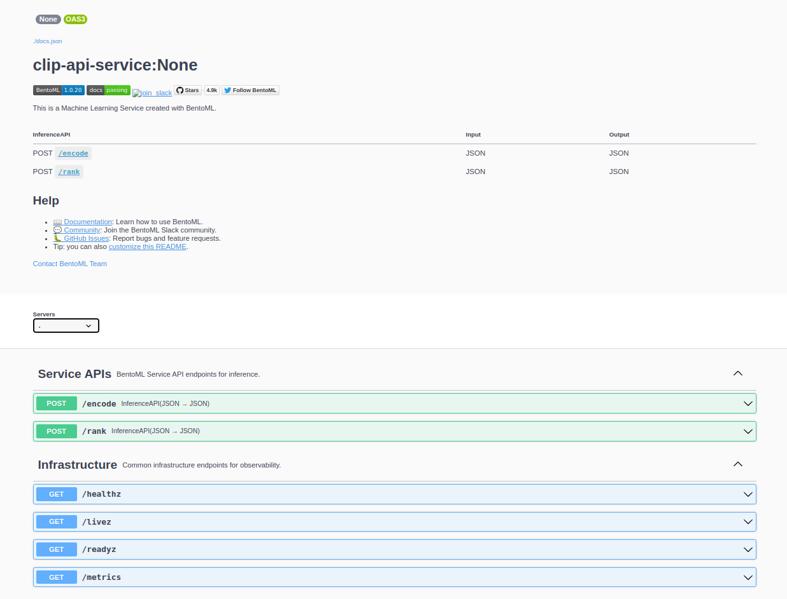

<div align="center">
    <h1 align="center">CLIP API Service</h1>
    <br>
    <strong>Discover the effortless integration of OpenAI's innovative CLIP model with our streamlined API service. <br></strong>
    <i>Powered by BentoML 🍱</i>
    <br>
</div>
<br>

## 📖 Introduction 📖
[CLIP](https://openai.com/research/clip), or Contrastive Language-Image Pretraining, is a cutting-edge AI model that comprehends and connects text and images, revolutionizing how we interpret online data.

This library provides you with an instant, easy-to-use interface for CLIP, allowing you to harness its capabilities without any setup hassles. BentoML takes care of all the complexity of serving the model!

## 🔧 Installation 🔧
Ensure that you have Python 3.8 or newer and `pip` installed on your system. We highly recommend using a Virtual Environment to avoid any potential package conflicts.

To install the service, enter the following command:
```bash
pip install clip-api-service
```

Once the installation process is complete, you can start the service by running:
```bash
clip-api-service serve --model-name=ViT-B-32:openai
```
Your service is now running! Interact with it via the Swagger UI at `localhost:3000`


## 🎯 Use cases 🎯
Harness the capabilities of the CLIP API service across a range of applications:

### Encode
1. Text and Image Embedding
    - Use `encode` to transform text or images into meaningful embeddings. This makes it possible to perform tasks such as:
        1. **Neural Search**: Utilize encoded embeddings to power a search engine capable of understanding and indexing images based on their textual descriptions, and vice versa.
        2. **Custom Ranking**: Design a ranking system based on embeddings, providing unique ways to sort and categorize data according to your context.

### Rank
2. Zero-Shot Image Classification
    - Use `rank` to perform image classification without any training. For example:
        1. Given a set of images, classify an image as being "a picture of a dog" or "a picture of a cat".
        2. More complex classifications such as recognizing different breeds of dogs can also be performed, illustrating the versatility of the CLIP API service.

3. Visual Reasoning
    - The `rank` function can also be used to provide reasoning about visual scenarios. For instance:

| Visual Scenario | Query Image | Candidates | Output |
|-----------------|-------|---------------|--------|
| Counting Objects |  | This is a picture of 1 dog<br>This is a picture of 2 dogs<br>This is a picture of 3 dogs | Image matched with "3 dogs" |
| Identifying Colors |   | The car is red<br>The car is blue<br>The car is green | Image matched with "blue car" |
| Understanding Motion |   | The car is parked<br>The car is moving<br>The car is turning| Image matched with "parked car" |
| Recognizing Location |   | The car is in the suburb<br>The car is on the highway<br>The car is in the street| Image matched with "car in the street" |
| Relative Positioning |  | The big car is on the left, the small car is on the right<br>The small car is on the left, the big car is on the right| Image matched with the provided description |
 

## 🚀 Deploying to Production 🚀
Effortlessly transition your project into a production-ready application using [BentoCloud](https://www.bentoml.com/bento-cloud/), the production-ready platform for managing and deploying machine learning models.

Start by creating a BentoCloud account. Once you've signed up, log in to your BentoCloud account using the command:

```bash
bentoml yatai login --api-token <your-api-token> --endpoint <bento-cloud-endpoint>
```
> Note: Replace `<your-api-token>` and `<bento-cloud-endpoint>` with your specific API token and the BentoCloud endpoint respectively.

Next, build your BentoML service using the `build` command:

```bash
clip-api-service build --model-name=ViT-B-32:openai
```

Lastly, push your freshly-built Bento service to BentoCloud using the `push` command:

```bash
bentoml push <name:version>
```


BentoML offers a number of options for deploying and hosting online ML services into production, learn more at [Deploying a Bento](https://docs.bentoml.org/en/latest/concepts/deploy.html).

## 📚 Reference 📚
### API reference
#### `/encode`
Accepts either:
* `img_uri` : An Image URI, i.e `https://hips.hearstapps.com/hmg-prod/images/dog-puppy-on-garden-royalty-free-image-1586966191.jpg`
* `text` : A string
* `img_blob` : Base64 encoded string

Returns a vector of embeddings of length 768.

**Example:**
```
curl -X 'POST' \
  'http://localhost:3000/encode' \
  -H 'accept: application/json' \
  -H 'Content-Type: application/json' \
  -d '[
  {
    "img_uri": "https://hips.hearstapps.com/hmg-prod/images/dog-puppy-on-garden-royalty-free-image-1586966191.jpg"
  },
  {
    "text": "picture of a dog"
  },
  {
    "img_blob": "iVBORw0KGgoAAAANSUhEUgAAABIAAAAPCAYAAADphp8SAAAABHNCSVQICAgIfAhkiAAAABl0RVh0U29mdHdhcmUAZ25vbWUtc2NyZWVuc2hvdO8Dvz4AAAApdEVYdENyZWF0aW9uIFRpbWUARnJpIDI2IE1heSAyMDIzIDA0OjE2OjIxIEFNCXIaIQAAAnhJREFUOI1Fk82OY0UMhT+7qu6dJPfmZ3p6EhYR3QSGnk0P6QV/4rlYsOIBeKrhIQAJtZCgNQsmEWiQSG5V2SwSeixZtiydYx9blpsJPpv2fPP1V3zx5ee8vHnJbDFlNl/Q9GMQBwLUAM7JcXADN9wN3Im1wOaja7afbfnk4xcsVytS25DaFsyptSDiaIyAnMn8kVTOMc6mI+62d2w2G5bLFZOuBxUkJsyNYoIGRVXfTyMCLmByIseJm+trbl58ynL5nK7v0dTgOGgENyQqsWlxdxxH4FEW7og7mBHvtq+4vHxG381IqQF3qjvBnOrgKBIiOR/fA89gMUPdoRpxe/uKbjym6zton4AZ6oZoRNxQUQiJOhzO3R1xeyTiXItXV1csLi4gRjADOIHdEEBEoGSCCOaOmUGtKI4CQQMIxL7vmIwmcBygAdoWAKuV6o5GwUwQB/HzjkTOufC/xZRaSi6IOjHFU1UVrRkrmTwcERViiohDQFANiAmYYbUgBnE8miAiDDlT/j0gQ0aj4qoklZMkHBsKIShBFJXTJLVWai64GbGUQnrSEori7ljO5Gy4gMZIahMpRA7DABZAwXGsVnIulOGIuxFfv/6RUdtwcfmM2XTKfDEnNYlcCjkP1BJIqYUChuNU3J1aM+Us382Jv97f8/d+x3w+YzbtWa5WLD94ztOnCyZdR0QRM8TkdACr1FqoJeNuuFUAwg/fffu9m7Hf73j4/Q9+/uUn3jw8YG6MRyNijFgtJG0wM8owMBwPlJKppZ6+RiA2TWK9XvPhes27f96x3+04Hg/s/vyLe/2N29ueyWxCzQe8Gvu3b0GUXCu7/Y5ijgblP3zyX4rqQyp1AAAAAElFTkSuQmCC"
  }
]'
```

#### `/rank`
Accepts a list of `queries` and a list of `candidates`. Similar to above, `queries` and `candidates` are either:
* `img_uri` : An Image URI, i.e `https://hips.hearstapps.com/hmg-prod/images/dog-puppy-on-garden-royalty-free-image-1586966191.jpg`
* `text` : A string
* `img_blob` : Base64 encoded string

Returns a list of probabilies and cosine similarities of each candidate with respect to the query.

**Example:**
```
curl -X 'POST' \
  'http://localhost:3000/rank' \
  -H 'accept: application/json' \
  -H 'Content-Type: application/json' \
  -d '{
  "queries": [
    {
      "img_uri": "https://hips.hearstapps.com/hmg-prod/images/dog-puppy-on-garden-royalty-free-image-1586966191.jpg"
    }
  ],
  "candidates": [
    {
      "text": "picture of a dog"
    },
    {
      "text": "picture of a cat"
    },
    {
      "text": "picture of a bird"
    },
    {
      "text": "picture of a car"
    },
    {
      "text": "picture of a plane"
    },
    {
      "text": "picture of a boat"
    }
  ]
}'
```
And the response looks like:
```
{
  "probabilities": [
    [
      0.9958375692367554,
      0.0022114247549325228,
      0.001514736912213266,
      0.00011969256593147293,
      0.00019143625104334205,
      0.0001251235808013007
    ]
  ],
  "cosine_similarities": [
    [
      0.2297772467136383,
      0.16867777705192566,
      0.16489382088184357,
      0.13951312005519867,
      0.14420939981937408,
      0.13995687663555145
    ]
  ]
}
```

### CLI reference
#### `serve`
Spins up a HTTP Server with the model of your choice.

Arguments:
* `--model-name` : Name of the CLIP model. Use `list_models` to see the list of available model. Default: `openai/clip-vit-large-patch14`

#### `build`
Builds a Bento with the model of your choice

Arguments:
* `--model-name` : Name of the CLIP model. Use `list_models` to see the list of available model. Default: `openai/clip-vit-large-patch14`

#### `list_models`
List all available CLIP models.
